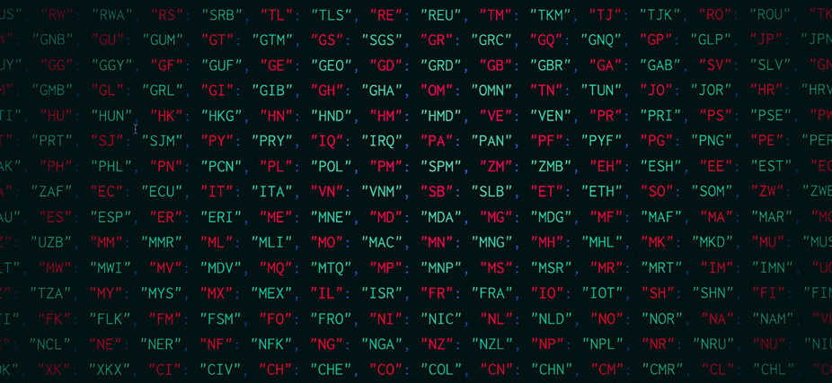

# APIs and JSON

#### -- Project Status: [Completed]

## Objective
Be able to exchange information via APIs and JSON protocols, send GET/POST/PATCH requests, read relevant information for specific APIs and manipulate JSON/XML files.

### Notebooks
* [json_theory](json_theory.ipynb)
* [http_requests](http_requests.ipynb)
* [google_api_how_to](pgoogle_api_how_to.ipynb)
* [google_api_roadtrip](google_api_roadtrip.ipynb)
* [nobel_prize_api_analysis](nobel_prize_api_analysis.ipynb)

### API sources
* [Google Places API](https://developers.google.com/maps/documentation/places/web-service)
* [Nobel Prize API](http://api.nobelprize.org/v1/prize.json)

### Technologies and packages
* Python
* JSON
* RESTful APIs
* Pyyaml
